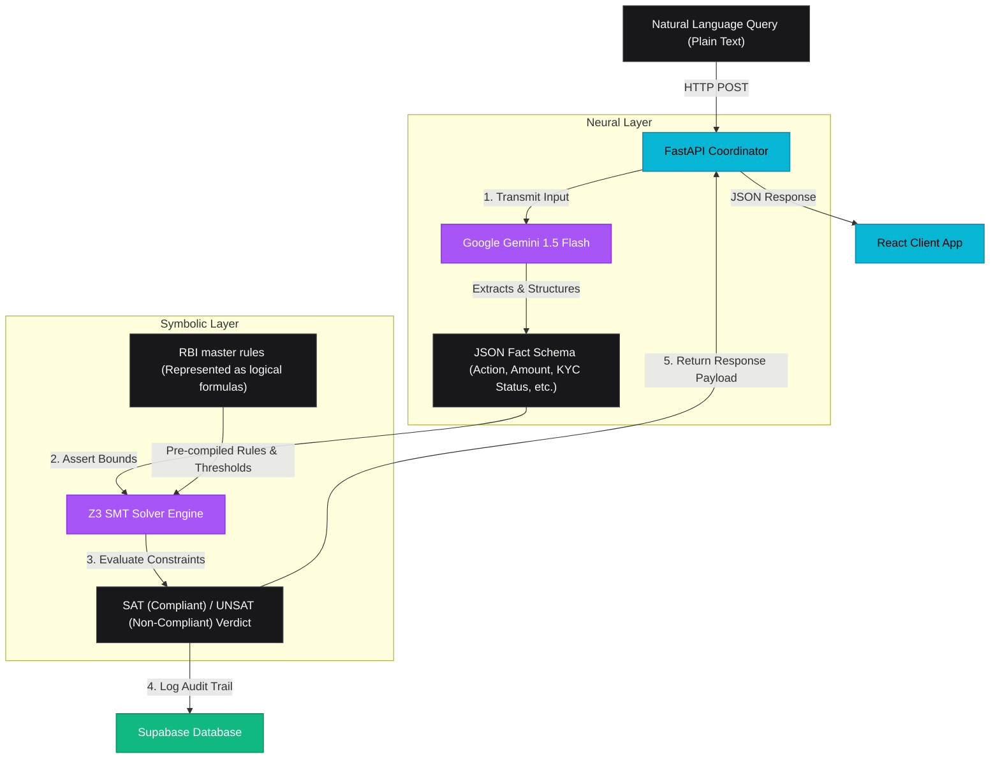
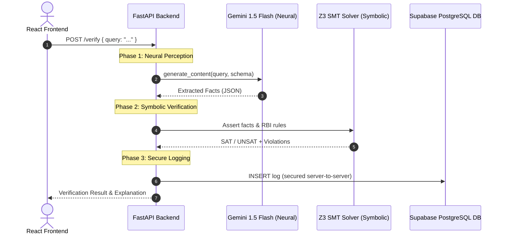

# AI-Powered RBI Banking Compliance Verifier
### *Hybrid Neuro-Symbolic Financial Guardrails (LLM + Z3 SMT Solver)*

[](https://github.com/VedikaAgrawal/neuro-symbolic-rbi-compliance/actions/workflows/ci.yml)
[](https://github.com/VedikaAgrawal/neuro-symbolic-rbi-compliance/actions/workflows/sync.yml)

An advanced, research-grade **Full-Stack compliance verification engine** designed for Indian Fintech and banking applications. 

🚀 **Live Web App**: [https://neuro-symbolic-rbi-compliance.vercel.app](https://neuro-symbolic-rbi-compliance.vercel.app/) 
🐳 **Live API Server**: [https://huggingface.co/spaces/vedika24/neuro-symbolic-compliance-api](https://huggingface.co/spaces/vedika24/neuro-symbolic-compliance-api)


* **The Problem**: RBI guidelines are massive (thousands of pages), complex, and change constantly.
* **The Risk**: If a bank makes a mistake—such as giving a ₹1.5 Crore loan to someone without verifying their collateral, or allowing high-value transfers on an unverified OTP account—they are non-compliant. The RBI can penalize them with millions of rupees in fines, legal audits, or even cancel their banking license.
* **Compliance Verification**: This is the process of checking a financial transaction before it executes to ensure it is 100% compliant with current banking laws.

This system takes everyday financial requests in plain English, parses them using AI (Gemini 1.5 Flash), and verifies them mathematically against official Reserve Bank of India (RBI) regulations using a symbolic logic solver (Z3 SMT) to guarantee 100% accurate, hallucination-free compliance audits.

Developed as an **M.Tech Research Project** demonstrating formal logic modeling and natural language auto-formalization.

---

## 🛠️ Tech Stack

* **Frontend**: React 18, Vite, TypeScript, Tailwind CSS (Glassmorphism & Dark Theme UI)
* **Backend**: Python 3.10+, FastAPI (High-performance ASGI framework)
* **Neural Layer (LLM)**: Google Gemini 1.5 Flash (Entity extraction & unstructured text auto-formalization)
* **Symbolic Layer (SMT)**: Microsoft Z3 SMT Solver (`z3-solver` for logical formula & constraint evaluation)
* **Database & Auth**: Supabase PostgreSQL (Secure server-side auditing logs & dynamic rule definitions)

---

## 🏛️ Pipeline Architecture

This system uses a hybrid approach to bridge unstructured human input with formal mathematical proofs:

1. **Neural Perception Layer (LLM)**: Parses natural language queries into structured JSON facts using **Google Gemini 1.5 Flash** with forced Pydantic schema validation.
2. **Symbolic Reasoning Layer (SMT)**: Feeds extracted facts as constant bounds into **Microsoft's Z3 SMT Solver**, verifying them against RBI directions represented as first-order logical formulas.
3. **Database Logging Layer (PostgreSQL)**: Logs transaction queries, verdicts, and violations securely to **Supabase** via backend API controllers.
4. **Actionable Compliance UI**: Renders verdicts, document checklists, and counterfactual resolution roadmaps dynamically inside a sleek, dark-theme glassmorphic React app.

### 🧱 Hybrid Neuro-Symbolic Architecture

This block diagram represents how data flows from unstructured input through the neural and symbolic compliance gates:



### ⏱️ System Flow Diagram




---

## 📂 Directory Layout

```
major_sem_4_2/
├── backend/                  # Python FastAPI API Server
│   ├── extractor.py          # Gemini structured fact parsing & plaintext summaries
│   ├── rules.py              # Central registry of RBI rule metadata & parameters
│   ├── solver.py             # Z3 SMT Solver constraint formulations & checks
│   ├── main.py               # API endpoints & Supabase logging controller
│   ├── requirements.txt      # Python dependencies (z3-solver, fastapi, etc.)
│   └── .env                  # Private backend keys (Gemini API & Supabase Key)
├── src/                      # React Frontend Source (Vite + TSX + Tailwind CSS)
│   ├── components/           # UI elements (ExampleQueries, FactsPanel, ResultCard)
│   ├── lib/
│   │   └── verifier.ts       # Frontend async API bridge to FastAPI
│   ├── App.tsx               # Main layout and local state
│   ├── index.css             # Main styling
│   └── main.tsx
├── dataset/
│   └── data/                 # Legal source files (Official RBI Mandates in PDF format)
├── setup_env.sh              # Automated script to rebuild virtual environment
├── package.json              # Frontend manifest & npm dependencies
├── tsconfig.json             # TypeScript compiler settings
└── tailwind.config.js        # Design tokens & glassmorphism configurations
```

---

## ⚡ Setup & Local Execution

Both the React dev server and the FastAPI server must be run simultaneously. 

### Prerequisites
* **Python 3.10+**
* **Node.js 18+**
* **Google Gemini API Key** (Get a free developer key at **[Google AI Studio](https://aistudio.google.com/)**)
* **Supabase Project** (A free Supabase account and project to host the database tables)


### 1. Backend Setup
1. Create the virtual environment and install packages:
   ```bash
   chmod +x setup_env.sh
   ./setup_env.sh
   ```
2. Open `backend/.env` and paste your Gemini API key:
   ```env
   GEMINI_API_KEY=...your_key_here
   ```
   *(If left blank, the server runs using a local Regex-based parser).*
3. Run the FastAPI ASGI server:
   ```bash
   ./venv/bin/uvicorn backend.main:app --reload --port 8000
   ```
   The backend will start listening at `http://localhost:8000`. You can visit `/health` to verify status or `/docs` to see the interactive Swagger UI.

### 2. Frontend Setup
1. Install node dependencies (if not already done):
   ```bash
   npm install
   ```
2. Run the Vite development server:
   ```bash
   npm run dev
   ```
   Open your browser at `http://localhost:5173`.

### 3. Supabase Setup & Rule Seeding

The application stores rule configurations and logs query results using a Supabase PostgreSQL database.

#### 1. Create a Supabase Project
1. Go to the [Supabase Dashboard](https://supabase.com/dashboard) and create a new project.
2. Select a name, password, region, and choose the Free tier.

#### 2. Apply Database Migrations
1. Open [20260502084109_create_guardrails_tables.sql](supabase/migrations/20260502084109_create_guardrails_tables.sql) and copy its entire SQL content.
2. In the Supabase Dashboard, click on **SQL Editor** in the left-hand sidebar.
3. Click **New query** -> **New Blank Query**, paste the copied SQL, and click **Run**. This will create the `rbi_rules` and `query_logs` tables with appropriate RLS policies.

#### 3. Configure Environment Variables
1. Go to **Project Settings** -> **API** in the Supabase Dashboard.
2. **Frontend Config**: Copy the **Project URL** and the **`anon` `public`** key, then add them to your root .env file:
   ```env
   VITE_SUPABASE_URL=https://your-project.supabase.co
   VITE_SUPABASE_ANON_KEY=your-anon-public-key
   ```
3. **Backend Config**: Copy the **`service_role` (secret)** key (this admin key is required so the backend can bypass RLS constraints for seeding/logging), then add it to your backend/.env file:
   ```env
   SUPABASE_URL=https://your-project.supabase.co
   SUPABASE_KEY=your-service-role-key
   ```

#### 4. Run the Seed Script
To populate the blank `rbi_rules` table with all 21 pre-defined RBI regulations:
```bash
./venv/bin/python -m backend.seed_rules
```
Once executed, you will see a confirmation message indicating that 21 rules have been successfully seeded/updated.


---

## 📜 RBI Regulation Coverage Index

The framework maps a total of **21 formal regulations** across official master publications, with **12 rules** active inside the symbolic logic check network:

* **Know Your Customer (KYC) Direction, 2016 (Updated Aug 2025) [6 Mapped Rules]**:
  * `KYC_001` to `KYC_003`: Caps on Small Accounts/OTP accounts (Single transfer ≤ ₹10k, annual credit ≤ ₹1L, balance ≤ ₹50k).
  * `KYC_004`: Mandates Full KYC for transactions/loans exceeding ₹50,000.
  * `KYC_005` & `KYC_006`: Mapped specifications for periodic Re-KYC intervals and Video KYC (V-CIP) onboarding.
* **Loans & Advances - Statutory & Other Restrictions [5 Mapped Rules]**:
  * `LOAN_001`: Caps unsecured personal loans at ₹10,00,000 without collateral.
  * `LOAN_002` & `LOAN_003`: Imposes requirements for loans > ₹25L and ≥ ₹1Cr (CIBIL score ≥ 700/750, collateral security, and 2/3 years of ITR).
  * `LOAN_004` & `LOAN_005`: Mapped rules prohibiting lending to bank directors/relations, and Priority Sector Lending (PSL) classifications.
* **Digital Lending Directions, 2025 [6 Mapped Rules]**:
  * `DL_001` & `DL_002`: Forces Key Fact Statement (KFS) acknowledgment and cooling-off intervals (3/7 days).
  * `DL_003` & `DL_004`: Restricts disbursement targets to verified bank accounts only, and caps Default Loss Guarantee (DLG) at 5%.
  * `DL_005` & `DL_006`: Mapped restrictions for Lending Service Provider (LSP) approvals and explicit customer data privacy consent.
* **Credit & Debit Card Directions, 2022 (Updated 2024) [4 Mapped Rules]**:
  * `CC_001` & `CC_002`: Forces MITC interest disclosures and imposes a minimum net annual income floor of ₹3,00,000.
  * `CC_003` & `CC_004`: Limits enhancement request gaps (6 months) and determines cardholder liability based on dispute reporting days (zero, partial, or full).

---

## 💡 Example Queries to Verify

Test these compliance scenarios inside the web interface:

### 1. UNSAT Verdict (Loan Implication Check)
* **Query**: *"I need a loan of 1 crore for my corporate business. I have standard KYC but no property to mortgage."*
* **SMT Verdict**: **UNSAT (Non-Compliant) ❌**
* **Direct Violations**:
  * *Collateral / Security is mandatory for loans ≥ ₹1 Crore.*
  * *Full KYC (Aadhaar + PAN) is mandatory for loans ≥ ₹1 Crore.*
* **Action Checklist**: Highlights mandatory docs (NOC, empanelled property valuation, CA Balance sheets) and criteria to satisfy.

### 2. UNSAT Verdict (Small Account Limits)
* **Query**: *"I want to transfer ₹35,000 using my small OTP account."*
* **SMT Verdict**: **UNSAT (Non-Compliant) ❌**
* **Direct Violations**:
  * *Single transfer amount ₹35,000 exceeds Small Account limit of ₹10,000.*
  * *Full KYC (Aadhaar + PAN) is mandatory for transactions/loans exceeding ₹50,000.*
* **Compliance Resolution Path**: Suggests upgrading the account to Full KYC via Video V-CIP or branch visit.

### 3. SAT Verdict (Compliant Transfer)
* **Query**: *"I want to transfer ₹5,000 using my basic small account."*
* **SMT Verdict**: **SAT (Compliant) ✅**
* **Checklist**: Confirms no rules are violated. The transaction is verified and logged securely.

---

## 🎓 M.Tech Thesis & Research Highlights
* **Deterministic Logic Execution**: Solves the AI safety problem by using Z3 to prove mathematically whether a transaction path violates a legal constraint, leaving zero room for LLM hallucinations.
* **Auto-Formalization**: Demonstrates structured JSON entity extraction from unstructured text to feed formal logic networks.
* **Human-in-the-Loop AI**: Explores RAG-based regulatory mapping where AI drafts rules, human compliance experts review, and Z3 executes them securely.
