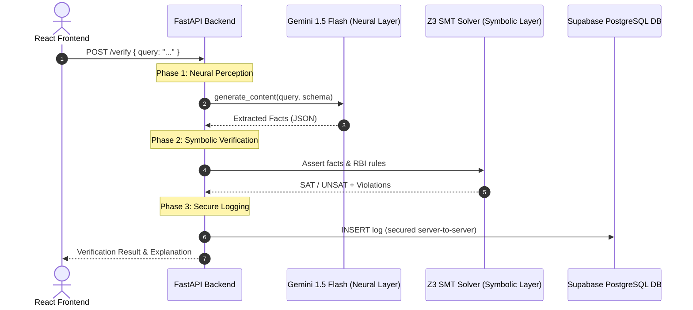

# Hybrid Neuro-Symbolic Compliance Guardrails Architecture

This document describes the pipeline architecture of the RBI Compliance Guardrails project.

## Architecture Pipeline Diagram

---

## Tooling & Rendering Information

The diagram above is written in **Mermaid.js** syntax. 
* **What is Mermaid?** Mermaid is an open-source, JavaScript-based diagramming and charting tool that uses Markdown-like text definitions to generate diagrams dynamically.
* **How to view/render it**:
  1. **GitHub / GitLab**: If you commit this file to a GitHub repository, GitHub will automatically render the diagram natively in the browser.
  2. **VS Code**: Install the "Markdown Preview Mermaid Support" extension to see it inside your editor's Markdown preview tab.
  3. **Live Editor**: You can copy-paste the sequence diagram code into the official [Mermaid Live Editor](https://mermaid.live/) to export it as an image (PNG, SVG, or PDF) for your project presentations, report documents, or thesis files.
