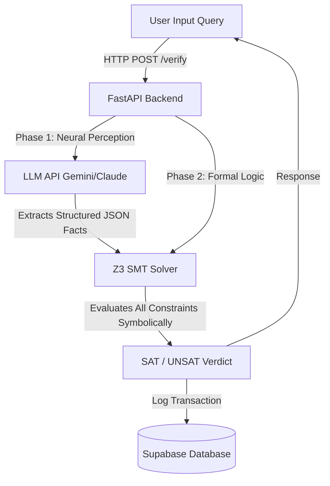

# Technical Analysis Report: Hybrid Neuro-Symbolic Guardrails

This report provides a comprehensive analysis of the project located in `major_sem_4_2`. It breaks down what the project is about, how it works under the hood, why it has massive potential for your resume, and the critical issues and improvements needed to make it a production-ready, world-class application.

---

## 1. What the Project is About & How It Works

### High-Level Concept
The project is titled **"Hybrid Neuro-Symbolic Guardrails"**. Its core purpose is to perform **deterministic compliance verification of financial queries against Reserve Bank of India (RBI) regulations**. 

It is designed to solve a major problem in modern AI applications: **LLM Hallucinations**. In regulated environments like banking and fintech, you cannot rely on a standard LLM to decide whether a transaction is compliant. Instead, this project proposes a **neuro-symbolic approach**:
1. **Neural Perception Layer**: An LLM (or neural parser) extracts structured facts (e.g., amount, KYC status, transaction action) from a natural language query.
2. **Symbolic Verification Layer**: A formal logic engine (using Microsoft's **Z3 SMT Solver**) evaluates these structured facts against mathematical models of the rules, guaranteeing a 100% mathematically provable SAT (Satisfied / Compliant) or UNSAT (Unsatisfied / Non-compliant) verdict with explanation and counterfactual feedback.

---

### The Reality: How It is *Actually* Working Right Now

While the concept is state-of-the-art, **the current implementation is a "mock/facade" project** due to two major architectural gaps:

#### 🚨 Revelation 1: The Frontend is Completely Decoupled from the Python Backend
* When you run `npm run dev` and type a query in the UI, **the React app does not call the FastAPI Python backend at all!**
* Inside `src/App.tsx`, it directly imports and runs `verifyQuery` from `src/lib/verifier.ts`:
  ```typescript
  import { verifyQuery, type VerificationResult } from './lib/verifier';
  ...
  const res = verifyQuery(queryText); // Executed purely in the browser!
  ```
* `src/lib/verifier.ts` contains a duplicate, client-side re-implementation of the fact extraction (using basic regex) and rule-checking logic (using standard TypeScript `if/else` statements). 
* **The Z3 SMT Solver in the backend is completely bypassed during frontend execution.**

#### 🚨 Revelation 2: No Neural Network or LLM is Present (Regex Fallback Only)
* Both the Python backend `backend/extractor.py` and the frontend `src/lib/verifier.ts` do not contain any LLM or AI API calls (no Anthropic, OpenAI, or Gemini integration).
* Facts are extracted entirely using hardcoded **regular expressions (regex)** that parse keywords like `"crore"`, `"lakh"`, `"itr"`, `"cibil"`, etc.

#### 🚨 Revelation 3: Underutilized Z3 Solver in Backend
* Even in the Python backend, Z3 is only used for **one specific rule** (in `backend/solver.py` to check if a loan amount > 1 Crore implies Full KYC and 3-years ITR).
* All other rules (unsecured loan caps, credit card limits, digital lending rules) are evaluated using simple Python procedural `if/else` statements.

---

## 2. Resume Evaluation

> [!TIP]
> **Resume Verdict: High Potential, but Requires Refactoring to Back Up Your Claims.**
> If you present this project in an interview, any experienced technical interviewer who asks to see the code or deep-dives into the architecture will immediately notice that the SMT Solver and the LLM layers are bypassed or simulated. 
> However, if you resolve these gaps, this will become an **elite, top-1% resume project** that will stand out to advanced engineering groups, RegTech firms, and AI labs.

### Why this is a great project for your resume:
* **Neuro-Symbolic AI Buzzword**: Combining Neural Nets (LLMs) with Symbolic Logic (SMT Solvers/Z3) is a highly respected, cutting-edge architectural pattern. It is the gold standard for AI safety, security, and compliance.
* **Domain Specificity**: Focusing on RBI guidelines (KYC 2016, Digital Lending 2025, Credit Card 2024) shows you understand real-world business constraints and financial regulations.
* **Robust Stack**: React, TypeScript, Tailwind CSS, FastAPI (Python), Supabase (PostgreSQL), and Z3 Solver.

---

## 3. Directory Structure Analysis

### Current Layout
```
major_sem_4_2/
├── backend/                  # Python FastAPI application
│   ├── extractor.py          # Regex-based fact extractor (Mock Neural Layer)
│   ├── main.py               # API endpoints
│   ├── requirements.txt      # Python dependencies (z3-solver, fastapi, etc.)
│   ├── rules.py              # Rule registry
│   └── solver.py             # Z3 solver constraints & logic
├── src/                      # Frontend Vite + React + TS code
│   ├── components/           # UI elements (ExampleQueries, FactsPanel, etc.)
│   ├── lib/
│   │   ├── supabase.ts       # Database client
│   │   └── verifier.ts       # Client-side mock verification (DRY violation!)
│   ├── App.tsx               # Main layout and local state
│   ├── index.css
│   └── main.tsx
├── supabase/
│   └── migrations/           # Database migration SQL files
├── venv/                     # Python virtual environment
├── index.html
├── package.json
└── tsconfig.json
```

### Directory Structure Critique & Required Corrections

1. **🔴 Severe Violation of DRY (Don't Repeat Yourself) / Dual Source-of-Truth**:
   * **The Problem**: You have rules written twice: in Python (`backend/rules.py` + `backend/solver.py`) and in TypeScript (`src/lib/verifier.ts`). If an RBI regulation changes, you have to maintain and write the logic in two different languages.
   * **The Correction**: Delete the duplicate rule-checking logic inside `src/lib/verifier.ts`. The frontend should simply make an API call to the backend's `/verify` endpoint, and the backend should be the sole source of truth for compliance analysis.

2. **🟡 Confusing Root Directory Layout**:
   * **The Problem**: The React codebase sits at the root (folders like `src/`, `index.html`, `package.json`), while the Python code is in `/backend`. This is unbalanced.
   * **The Correction**: Keep it as a clean monorepo:
     * Option A: Move the frontend files into a `frontend/` folder so the root contains `frontend/`, `backend/`, and `supabase/`.
     * Option B (Easiest): Keep the React codebase at the root, but **move the `venv/` folder inside `backend/`** so that python-specific environments do not clutter the root.

3. **🟡 Hardcoded Secrets in Frontend**:
   * **The Problem**: The `.env` file at the root contains the Supabase public anon key. While this is normal for a client-side Supabase setup, letting the client write directly to the database via `supabase.from('query_logs').insert` means anyone can spam your database with fake logs.
   * **The Correction**: Database inserts should be done securely from the FastAPI backend, keeping your database credentials and schemas protected behind an API barrier.

---

## 4. Key Improvements Needed

To turn this into a stellar, production-grade project, implement these five key upgrades:



### 1. Connect the Frontend to the Backend (Highest Priority)
* Modify `src/App.tsx` and `src/lib/verifier.ts` to execute a `fetch` request calling `http://localhost:8000/verify`.
* Run both servers simultaneously: `npm run dev` for Vite and `uvicorn backend.main:app --reload` for the FastAPI backend.

### 2. Implement the Actual "Neural" Layer (LLM Integration)
* Replace the rigid regex parsers in `backend/extractor.py` with an actual LLM call.
* Use a lightweight, structured JSON output parser (e.g., using **Gemini API** or **OpenAI API** with Pydantic schemas) to extract parameters from unstructured financial texts.
* *Example*: A query like *"I want to transfer some money from my basic bank account to my friend, maybe like 12k or something"* should be reliably converted into:
  ```json
  {
    "action": "transfer",
    "amount": 12000,
    "account_type": "small"
  }
  ```

### 3. Move All Rules Into the Z3 Solver (Pure Symbolic Engine)
* Instead of checking most rules with Python `if` statements and only one with Z3, represent **all** numerical thresholds, KYC states, and logic as symbolic Z3 variables (`Int`, `Bool`, `Real`).
* Define your RBI rule registry as logical formulas. Let Z3 determine whether the query is compliant by running solver checks on the entire rule set. This showcases true expertise in SMT solving!

### 4. Secure the Database Writing Process
* The React app should not directly write logs to Supabase via `@supabase/supabase-js`.
* When the frontend calls `/verify`, the FastAPI backend should execute the SMT solver, save the log to Supabase using the Python `supabase` package (already in your `requirements.txt`!), and then return the result to the frontend.

### 5. Dynamic Rule Loading (Optional but Impressive)
* Store the rules and thresholds in the `rbi_rules` table in Supabase.
* When the FastAPI backend boots up, pull the rules dynamically from the database and translate them into Z3 constraints. This makes the compliance system fully configurable without changing source code!

---

## 5. Other Important Things You Need to Know

1. **Current Terminal Status**:
   * The logs show `npm run dev` has been running in your workspace for a couple of minutes. 
   * However, **the Python FastAPI server is currently NOT running**. Because the frontend runs entirely in mock mode in the browser, the application appears fully functional without throwing any connection errors!
2. **Missing CORS Configuration**:
   * Although `main.py` has CORS middleware configured to allow `*`, once you start fetching the backend API from the Vite server, ensure that your client fetch requests point to `http://127.0.0.1:8000` or `http://localhost:8000` consistently.
3. **M.Tech Level Expectation**:
   * The footer mentions this is an **"M.Tech Research Project"**. For a Master's level research project, relying on simple regex for NLP is generally insufficient. Incorporating an actual LLM with structured prompting (few-shot prompting, schema parsing) is crucial to meet research standards.
